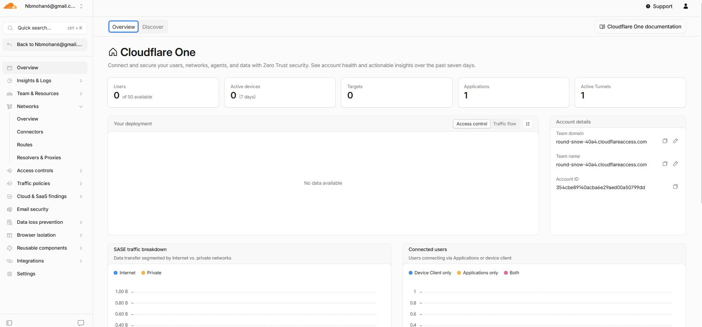
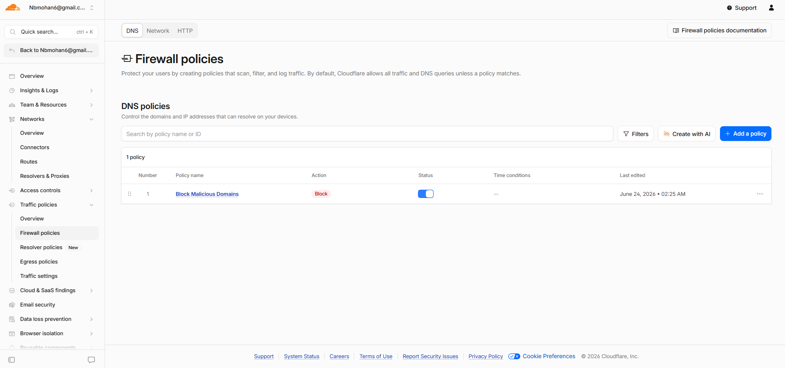
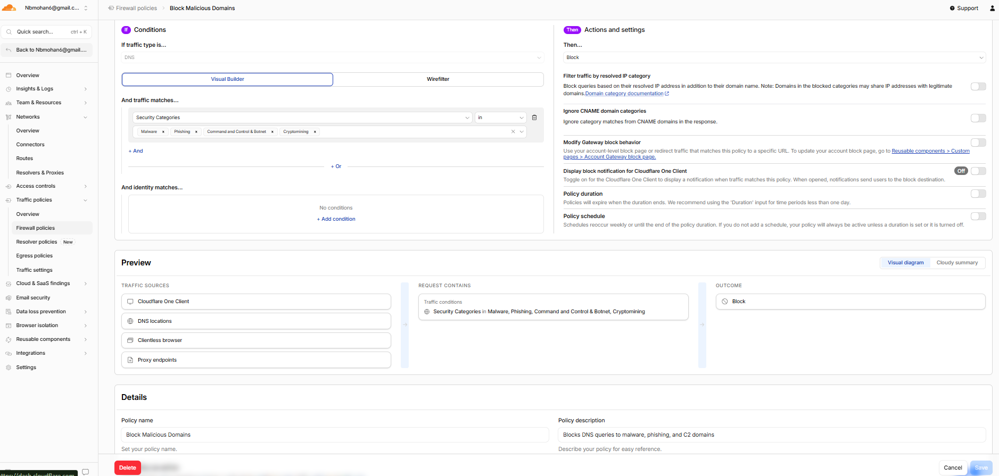
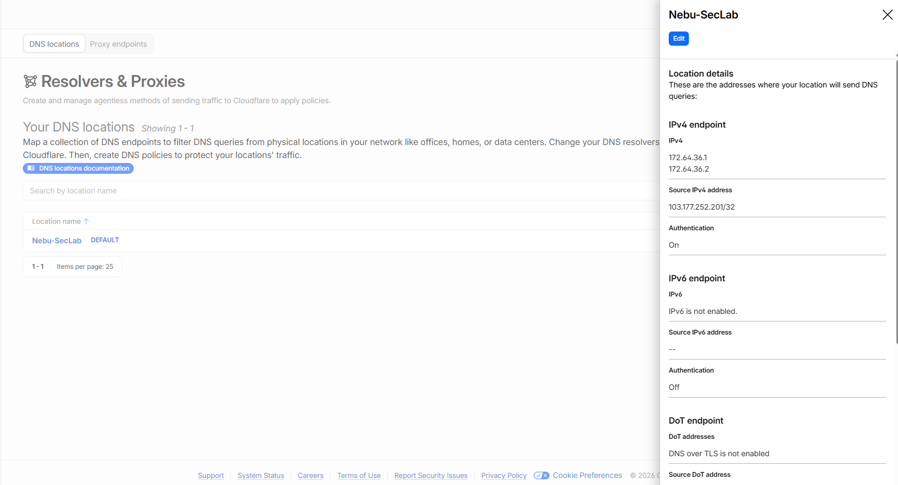
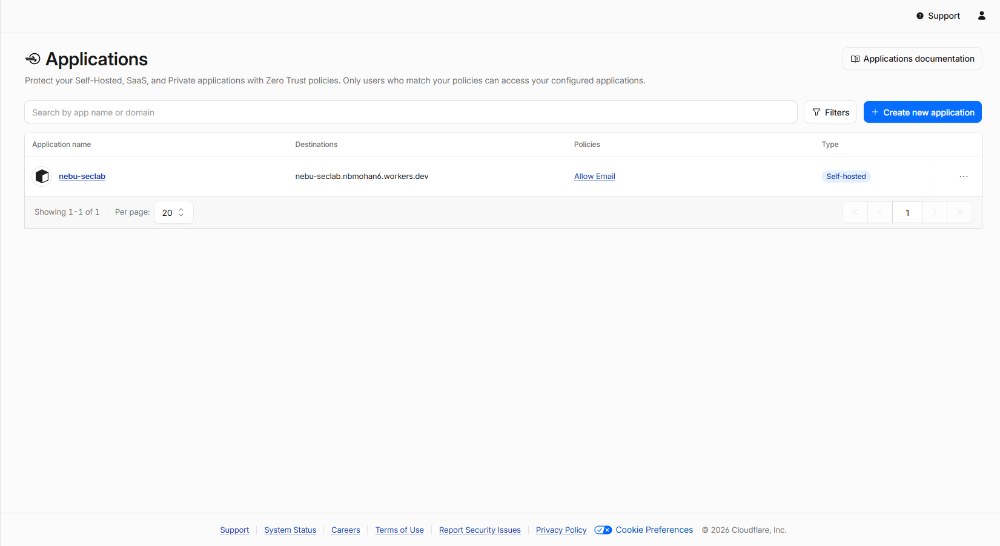
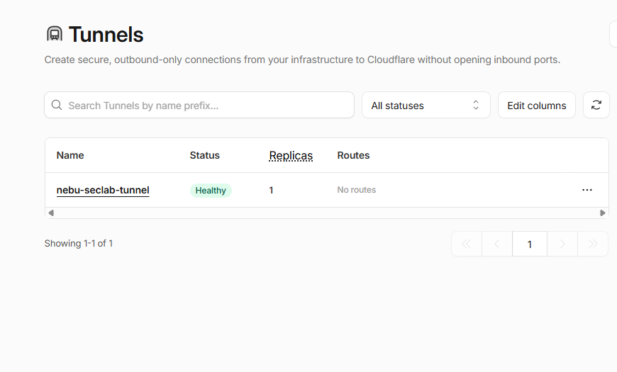

# Cloudflare Zero Trust Lab

A hands-on security lab demonstrating Cloudflare Zero Trust architecture — covering DNS threat prevention, identity-based access control, and secure tunnel deployment using Cloudflare One.

## What This Lab Covers

- Cloudflare Gateway DNS filtering to block malicious domains at the resolver level
- Zero Trust Access policy protecting a Cloudflare Worker with email-based identity verification
- Cloudflare Tunnel deployment as a Windows service with healthy connector status
- Network location registration with a dedicated Gateway resolver endpoint

## Architecture

```
┌─────────────────────────────────────────────────────────────────┐
│                        Your Machine (Windows)                    │
│                                                                  │
│   ┌─────────────────┐         ┌──────────────────────────────┐  │
│   │  Local Service  │────────▶│  cloudflared (Windows svc)   │  │
│   └─────────────────┘         └──────────────┬───────────────┘  │
└──────────────────────────────────────────────│──────────────────┘
                                               │ Outbound only
                                               │ No open ports
                                               ▼
┌─────────────────────────────────────────────────────────────────┐
│                       Cloudflare Network                         │
│                                                                  │
│  ┌──────────────────────────────────────────────────────────┐   │
│  │                  Zero Trust Gateway                       │   │
│  │          DNS filtering at the resolver level              │   │
│  │                                                           │   │
│  │   Blocks: Malware │ Phishing │ C2 │ Botnet │ Cryptomining │   │
│  │   Resolver IPv4: 172.64.36.1                             │   │
│  │   DoH: https://8cx80l8pz8.cloudflare-gateway.com/...    │   │
│  └──────────────────────────────────────────────────────────┘   │
│                                                                  │
│  ┌──────────────────────────────────────────────────────────┐   │
│  │                  Zero Trust Access                        │   │
│  │         Identity verification before app access           │   │
│  │                                                           │   │
│  │   App: Nebu-SecLab Worker                                │   │
│  │   Policy: Allow — email-based identity                   │   │
│  │   Session: 24 hours                                      │   │
│  └──────────────────────────────────────────────────────────┘   │
│                                                                  │
│  ┌──────────────────────────────────────────────────────────┐   │
│  │                  Cloudflare Tunnel                        │   │
│  │         Secure outbound connector to CF network           │   │
│  │                                                           │   │
│  │   Tunnel: nebu-seclab-tunnel                             │   │
│  │   Connector: Healthy                                     │   │
│  │   Active Tunnels: 1                                      │   │
│  └──────────────────────────────────────────────────────────┘   │
│                                                                  │
│  ┌──────────────────────────────────────────────────────────┐   │
│  │                  Cloudflare Worker                        │   │
│  │                                                           │   │
│  │   Endpoint: production.nebu-seclab.nbmohan6.workers.dev  │   │
│  │   Protected by: Zero Trust Access policy                 │   │
│  └──────────────────────────────────────────────────────────┘   │
└─────────────────────────────────────────────────────────────────┘
```

## Components Built

### 1. Cloudflare Worker
Deployed a serverless Worker on Cloudflare's edge network as the protected application endpoint for this lab.

- **Endpoint:** `production.nebu-seclab.nbmohan6.workers.dev`
- **Purpose:** Acts as the internal application protected by Zero Trust Access
- **Deployment:** Manually deployed via Cloudflare dashboard

---

### 2. Zero Trust Gateway — DNS Threat Prevention
Configured a Gateway DNS policy that blocks five threat categories at the resolver level — before any HTTP connection is ever established. This is the first line of defense in a Zero Trust network.

| Threat Category | Action | Why |
|---|---|---|
| Malware | Block | Prevents endpoints from reaching known malware distribution infrastructure |
| Phishing | Block | Stops credential harvesting at the DNS layer |
| Command & Control | Block | Disrupts attacker C2 communication channels |
| Botnet | Block | Prevents infected devices from checking in with botnet controllers |
| Cryptomining | Block | Blocks unauthorized use of compute resources |

**How it works:** Any DNS query matching these categories is intercepted by Cloudflare Gateway and returned as NXDOMAIN — the domain never resolves, so no connection is possible.

---

### 3. DNS Location
Registered the local network as a trusted Gateway location, routing all DNS queries through Cloudflare's resolver and applying the threat prevention policy.

| Setting | Value |
|---|---|
| Location Name | Nebu-SecLab |
| Gateway IPv4 | 172.64.36.1 |
| DoH Endpoint | https://8cx80l8pz8.cloudflare-gateway.com/dns-query |
| Source IP | 103.177.252.201 |
| Endpoint Type | IPv4 + DNS over HTTPS |

---

### 4. Zero Trust Access — Identity-Based Access Control
Protected the Cloudflare Worker behind an identity verification layer. Any attempt to reach the Worker endpoint triggers an authentication check — unauthenticated requests are blocked by default.

| Setting | Value |
|---|---|
| Application | Nebu-SecLab Worker |
| Destination | nebu-seclab.nbmohan6.workers.dev |
| Policy Name | Allow Email |
| Policy Action | Allow |
| Identity Selector | Email address |
| Session Duration | 24 hours |

**How it works:** When a user hits the Worker URL, Cloudflare Access intercepts the request and presents an identity challenge. Only the approved email passes. Everyone else gets a block page — no traffic reaches the Worker at all.

---

### 5. Cloudflare Tunnel
Deployed `cloudflared` as a persistent Windows service, creating a secure outbound-only connection between the local machine and Cloudflare's network. No firewall ports were opened.

| Setting | Value |
|---|---|
| Tunnel Name | nebu-seclab-tunnel |
| Connector Status | Healthy |
| Deployment Method | Windows Service |
| Connection Type | Outbound only |
| Active Tunnels | 1 |

**How it works:** `cloudflared` establishes persistent outbound connections to Cloudflare's nearest data centers. Cloudflare proxies inbound traffic through these connections — the origin machine never needs an open inbound port.

---

## Screenshots

### Cloudflare One Overview


### DNS Policy — Block Malicious Domains


### DNS Policy Detail


### DNS Location — Nebu-SecLab


### Zero Trust Access Application


### Tunnel Status — Healthy


---

## Key Concepts Demonstrated

**Zero Trust Architecture**
Default-deny model where no user, device, or network is trusted by default. Every access request is explicitly verified against identity and policy before access is granted.

**DNS-Layer Security**
Blocking threats at the DNS resolution stage — before any TCP connection, before any HTTP request, before any payload is exchanged. This is the earliest possible point of intervention in the network stack.

**Identity-Based Access Control**
Replacing implicit network perimeter trust with explicit user identity verification. The Worker endpoint is unreachable without passing an identity check — network location provides zero trust by itself.

**Secure Tunneling**
Outbound-only connectivity using `cloudflared` eliminates the need for inbound firewall rules or exposed ports. The attack surface of the origin machine is significantly reduced.

---

## SOC Relevance

In a real MSSP environment, these Cloudflare components generate security-relevant telemetry:

- **Gateway DNS logs** — blocked query events, threat category matches, source IP attribution
- **Access logs** — authentication attempts, policy decisions, session activity
- **Tunnel logs** — connector health, connection drops, reconnection events

A SOC analyst monitoring Cloudflare One would triage alerts from all three sources, correlate blocked DNS queries against endpoint activity, and escalate confirmed threat patterns.

---

## Tools Used

- Cloudflare One (Zero Trust platform)
- Cloudflare Gateway (DNS filtering and threat prevention)
- Cloudflare Access (identity-based access control)
- Cloudflare Workers (serverless edge application)
- Cloudflare Tunnel / cloudflared v2026.6.1
- Windows Service Manager

---

## Author

Nebu Mohan
[LinkedIn](https://linkedin.com/in/nebumohan) | [GitHub](https://github.com/nebumohan)
